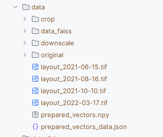

# Описание

Данный репозиторий содержит код для работы с данными.

В некоторый скриптах используются docker контейнеры, поэтому перед их использованием необходимо его установить [Ссылка](https://www.docker.com/get-started/)

# Конфигурирование

Конфигурирование проекта осуществляется через файл config.py в котором каждый класс является конфигурационным файлом 

# 3 Установка и запуск

Процесс предобработки данных состоит из 3-х этопов:

- Получение снимков с разной разрешающей способностью
- Нарезка их на плитки (кропы)
- Векторизация плиток (кропов), загрузка их в FAISS и базу данных (сервера)[https://github.com/betepok506/DTL-api/tree/develop]

Первые два этапа подготовливают изображения для последующей векторизации. Этот этап очень долгий (Вне докера гораздо быстрее, но не хватило времени его настроить).
Поэтому есть возможность пропусить эти 2 этапа, скачав предварительно подготовленные вектора, (ссылка)[https://disk.yandex.ru/d/8K8fPUxRh1qlNg] 
В папке два файла:
- prepared_vectors.npy - предварительно подготовленные вектора признаков изображений;
- prepared_vectors_data.json - метаданные векторов (сопутствущая информация)

Для пропуска 1-2 и части 3-го этапа эти файлы необходимо положить в папку `/data`

Результат должен выглядеть вот так:



Если вы положили эти файлы, то можете смело переходить к этапу "3.3 Векторизация изображений подложки и загрузка в БД"

Если же вы хотите подготоваить вектора сами и воспроизвести результат, то все контейнеры необходимо запустить по порядку описанному ниже.

## 3.1 Уменьшение разрешающей способности

Для получения снимков, содержащих разную пространственную информацию было принято решение произвести даунскейлинг 
снимков с разной разрешающей способностью после чего произвести их нарезку на плитки. 
Данный способ должен помочь улучшить качество поиска части снимка на подложке 


Перед началом работы необходимо изображения подложек положить в папку `./data`

Для сборки контейнера используйте команду:
```commandline
docker build -t downscale-container -f downscale.Dockerfile .
```

Для запуска необходимо воспользоваться командой:
```commandline
docker run --rm -v  "$(PWD)\\data:/data" -e INPUT_PATH_ROOT_DATASET='/data' -e OUTPUT_DIR='/data' downscale-container
```
где параметры имеют следующее значение:
- INPUT_PATH_ROOT_DATASET - путь к корневой директории набора данных
- OUTPUT_DIR - путь к директории для сохранения уменьшенных изображений

В результате работы контейнера в каталоге OUTPUT_DIR создаются следующие каталоги:
- original - Данный каталог содержит оригинальные изображения
- downscale - Данный каталог содержит набор каталогов, где в каждом каталоге содержится набор изображений с разной разрешающей способностью для каждого слоя

Примерная структура

/data
├── downscale
│   ├── layout_2021-06-15_downscale
│   │   ├── layout_2021-06-15_downscale_50x50.tif
│   │   ├── layout_2021-06-15_downscale_50x60.tif
...
│   │   └── layout_2021-06-15_downscale_80x80.tif
│   └── layout_2022-03-17_downscale
└──original
   ├── layout_2021-06-15.tif
    ...
   └── layout_2022-03-17.tif

## 3.2 Нарезка снимков на плитки

Для сборки контейнера используйте команду:
```commandline
docker build -t crop-layout-container -f crop_layout.Dockerfile .
```

Для запуска необходимо воспользоваться командой:
```commandline
docker run --rm -v  "$(PWD)\\data:/data" -e INPUT_PATH_ROOT_DATASET='/data' -e OUTPUT_BASE_DIR='/data/crop' -e STEP_MULTIPLIER=1 crop-layout-container
```
где параметры имеют следующие значения:
- INPUT_PATH_ROOT_DATASET - путь к корневой директории набора данных
- OUTPUT_BASE_DIR - путь к выходной директории
- STEP_MULTIPLIER - множитель для шага обрезки (относительно ширины изображения)

В результате работы контейнера в каталоге OUTPUT_BASE_DIR создаются следующие каталоги:
- crop - Данный каталог содержит извлеченные плитки из изображений

## 3.3 Векторизация изображений подложки и загрузка в БД

Для извлечения признаков из нарезанных изображений необходимо их векторизовать и загрузить в БД.
Для хранения векторов признаков изображений будем использовать FAISS, для хранения информации PostgreSQL.

Перед запуском этого этапа необходимо запустить сервер (https://github.com/betepok506/DTL-api) выполнить первый этап запуска.

**Также необходимо загрузить веса модели (ссылка)[https://disk.yandex.ru/d/UzcSbTGY9nNOSA]**

Далее необходимо создать сеть Docker, если она не была ранее создана:
```commandline
docker network create network-aerial-photography
```

Далее сборки контейнера извлечения признаков используйте команду:
```commandline
docker build -t extracting-features-container -f extracting_features.Dockerfile .
```

Перед запуском модели необходимо создать каталог `/weights/`, если он не был ранее создан, и положить туда веса модели.

Для запуска контейнера извлечения признаков используйте команду
```commandline
docker run --gpus all --network=network-aerial-photography -v  "${PWD}/weights:/weights" -v "${PWD}//data:/data" -v "${PWD}\\data\\data_faiss:/data_faiss" -e PATH_TO_WEIGHT='/weights/resnet50_3.pth' -e NAME_MODEL='resnet50' extracting-features-container
```
где:
- PATH_TO_WEIGHT - Путь до весов модели
- NAME_MODEL - Название модели

В результате работы в каталоге `./data/data_faiss` будет создан индекс FAISS (файл `faiss_index.index`), 
который необходимо переместить в каталог `/dependencies/db_faiss`
(сервера DTL-api)[https://github.com/betepok506/DTL-api]. Более подробную инструкцию смотреть там

## 3.4 Создание набора данных для обучения нейронной сети

Данный пункт содержит информацию по запуску скрипта для создания набора для обучения (нейронной сети)[https://github.com/betepok506/DTL-neural-network]

Конфигурирование скрипта осуществляется с помощью класса `CreateDatasetConfig` в файла `config.py`

Параметры конфигурации:
```commandline
- path_to_data --- Путь до каталога с нарезанными плитоками (кропов)
- path_to_save_data --- Путь до папки, куда будет сохранен набор данных
```

Перед запуском скрипта необходимо установить все зависимости, выполнив команду:
```commandline
pip install -r requirements.txt
```

Далее запустить скрипт create_dataset.py с корневого каталога.

В результате работы скрипта будет создан набор данных для обучения нейронной сети.